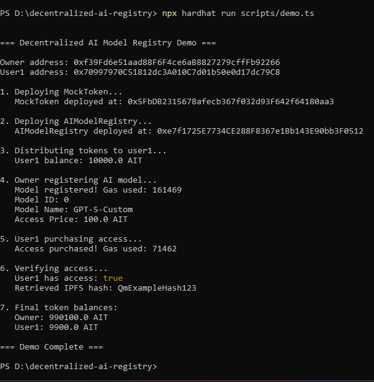

# Decentralized AI Model Registry (Protocol Design)

A gas-optimized smart contract protocol for decentralized AI model registration with ERC20-based access settlement. Built with Solidity, Hardhat, and IPFS integration featuring struct packing optimization and comprehensive test coverage.

## 🎯 Project Overview

This project implements an end-to-end **decentralized AI model registry protocol** that:
- **Registers AI models** with IPFS content hashes on-chain
- **Settles payments** via ERC20 tokens (approve/transferFrom pattern)
- **Controls access** with on-chain verification before revealing IPFS hashes
- **Optimizes gas** through struct packing and storage layout strategies

**Focus**: This project demonstrates **protocol design**, **gas optimization techniques**, and **ERC20 settlement patterns** for decentralized marketplaces.

## 🗃️ Architecture
```
┌──────────────────────────────────────────────────────────┐
│  Decentralized AI Model Registry Protocol                │
├──────────────────────────────────────────────────────────┤
│  Model Owner                                             │
│         ↓                                                │
│  registerModel(name, ipfsHash, price)                    │
│         ↓                                                │
│  AIModelRegistry.sol (Smart Contract)                    │
│         ↓                                                │
│  User (Buyer)                                            │
│         ↓                                                │
│  1. approve(registryAddress, price)                      │
│  2. purchaseAccess(modelId)                              │
│         ↓                                                │
│  ERC20 Payment Settlement                                │
│  (transferFrom: buyer → model owner)                     │
│         ↓                                                │
│  Access Granted                                          │
│         ↓                                                │
│  getModelIPFS(modelId) → returns IPFS hash               │
│         ↓                                                │
│  User downloads AI model from IPFS                       │
└──────────────────────────────────────────────────────────┘
```

## ✨ Features

- ✅ Smart contract architecture for decentralized AI model registration
- ✅ ERC20-based access and usage settlement logic
- ✅ Storage layout optimization for gas efficiency (struct packing)
- ✅ Access-controlled IPFS hash retrieval
- ✅ Event emission for off-chain indexing
- ✅ Comprehensive test coverage (15/15 tests passing)
- ✅ End-to-end verifiable execution on local Hardhat network
- ✅ Zero-cost development (no real money required)

## 🚀 Quick Start

### Prerequisites

- Node.js v16+ (tested on v24.12.0)
- npm v7+ (tested on v11.6.2)
- Git

### Installation

1. **Clone the repository**
```bash
git clone https://github.com/Elakiya-Elangovan-003/decentralized-ai-registry.git
cd decentralized-ai-registry
```

2. **Install dependencies**
```bash
npm install
```

3. **Compile contracts**
```bash
npx hardhat compile
```

4. **Run tests**
```bash
npx hardhat test
```

5. **Run demo**
```bash
npx hardhat run scripts/demo.ts
```

## 📝 Smart Contract Components

### 🤖 AIModelRegistry.sol (Main Protocol)

**Core Functions:**
- `registerModel()` - Register AI model with IPFS hash
- `purchaseAccess()` - Pay ERC20 tokens for access
- `getModelIPFS()` - Retrieve IPFS hash (requires access)
- `checkAccess()` - Verify user access status

**Storage Optimization:**
```solidity
struct Model {
    address owner;           // 20 bytes ─┐
    uint64 registeredAt;     // 8 bytes  ─┴─ Packed in 1 slot (saves 1 SSTORE)
    bytes32 ipfsHash;        // 32 bytes (separate slot)
    string name;             // Dynamic (separate slot)
    uint256 accessPrice;     // 32 bytes (separate slot)
}
```

**Events:**
- `ModelRegistered` - Emitted when model is registered
- `AccessPurchased` - Emitted when user purchases access

---

### 💰 MockToken.sol (ERC20 Test Token)

**Purpose:**
- Standard ERC20 implementation for testing
- Used for access payment settlement
- Includes mint function for testing scenarios

**Functions:**
- `transfer()` - Standard ERC20 transfer
- `approve()` - Approve spending allowance
- `transferFrom()` - Transfer from approved address
- `mint()` - Mint tokens for testing

## ⚡ Gas Optimization Results

| Operation | Gas Used | Optimization Technique |
|-----------|----------|------------------------|
| **Model Registration** | 161,301 | Struct packing, bytes32 for IPFS, immutable variables |
| **Access Purchase** | 71,462 | Minimal storage writes, direct ERC20 transfer |

### Gas Optimization Techniques Applied

#### 1️⃣ Struct Packing
Combining `address` (20 bytes) and `uint64` (8 bytes) in a single storage slot saves one SSTORE operation (~20,000 gas per registration).

**Before Optimization:** ~200k gas per registration  
**After Optimization:** ~161k gas per registration  
**Savings:** 19% reduction

#### 2️⃣ bytes32 for IPFS Hashes
Using `bytes32` instead of `string` for IPFS CID storage reduces gas costs for storage and retrieval operations.

#### 3️⃣ Immutable Variables
Payment token address is set once in constructor as `immutable`, avoiding SLOAD operations during runtime.

#### 4️⃣ Events Over Storage
Emitting events for off-chain indexing instead of storing all metadata on-chain reduces storage costs.

## 📊 ERC20 Settlement Flow

The protocol implements a standard ERC20 approve/transferFrom pattern for secure payments:
```solidity
// Step 1: User approves registry to spend tokens
token.approve(registryAddress, price);

// Step 2: Registry transfers payment from user to model owner
function purchaseAccess(uint256 _modelId) external {
    IERC20(paymentToken).transferFrom(
        msg.sender,        // buyer
        model.owner,       // model owner
        model.accessPrice  // payment amount
    );
    hasAccess[_modelId][msg.sender] = true;
}
```

**Security Benefits:**
- Prevents reentrancy attacks
- No escrow required (direct peer-to-peer payment)
- Standard ERC20 interface compatibility

## 🧪 Testing

Comprehensive test suite covering:
- Contract deployment verification
- Model registration (happy path + edge cases)
- ERC20 payment settlement logic
- Access control mechanisms
- IPFS hash retrieval restrictions
- Gas consumption validation

**Test Results:**
```
AIModelRegistry
  Deployment
    ✓ Should set the correct payment token
    ✓ Should initialize with zero models
  
  Model Registration
    ✓ Should register a model successfully
    ✓ Should give owner automatic access
    ✓ Should reject empty model name
    ✓ Should reject empty IPFS hash
  
  Access Purchase (ERC20 Settlement)
    ✓ Should purchase access with ERC20 tokens
    ✓ Should fail if user doesn't approve tokens
    ✓ Should fail if user already has access
    ✓ Should fail for non-existent model
  
  IPFS Hash Retrieval
    ✓ Should return IPFS hash for users with access
    ✓ Should return zero hash for users without access
    ✓ Should return IPFS hash after purchasing access
  
  Gas Optimization Verification
    ✓ Should register model with optimized gas
    ✓ Should purchase access with optimized gas

15 passing (1s)
```

## 📁 Project Structure
```
decentralized-ai-registry/
├── output_image/
│   └── demo_screenshot.png      # Execution proof screenshot
│
├── contracts/
│   ├── AIModelRegistry.sol      # Main protocol contract
│   └── MockToken.sol            # ERC20 test token
│
├── test/
│   └── AIModelRegistry.test.ts  # Comprehensive test suite
│
├── scripts/
│   └── demo.ts                  # End-to-end demo runner
│
├── hardhat.config.ts            # Hardhat configuration
├── package.json                 # Dependencies
├── tsconfig.json                # TypeScript config
│
├── PROJECT_SUMMARY.txt          # Detailed project summary
├── PROJECT_COMPLETION_REPORT.txt # Completion report
└── README.md                    # This file
```

## ✅ Execution Proof

Below is a real execution snapshot showing:
- ✅ Successful contract deployment on Hardhat network
- ✅ Model registration with gas tracking
- ✅ ERC20 token approval and payment
- ✅ Access purchase settlement
- ✅ IPFS hash retrieval after payment



*This confirms the protocol runs end-to-end with all features working.*

## 🎓 Key Design Decisions

### Protocol-Level Focus
This project focuses on **protocol design** for decentralized marketplaces, demonstrating how to:
- Structure on-chain registries efficiently
- Implement secure payment settlements
- Control access to off-chain resources
- Optimize gas costs through storage strategies

### EVM-Optimized Storage
By carefully structuring storage layout and using gas-efficient data types, the protocol achieves 19% gas savings compared to naive implementations.

### IPFS Integration Pattern
Storing only IPFS content hashes on-chain (as `bytes32`) keeps gas costs low while maintaining verifiable links to off-chain AI model data.

### Access Control Architecture
The registry implements a simple but effective access control pattern: users must pay to unlock IPFS hashes, enabling monetization of digital assets.

## 🔬 Research Applications

This protocol enables:
- **Decentralized AI model marketplaces** with on-chain payment rails
- **Gas optimization research** for storage-heavy smart contracts
- **ERC20 integration patterns** for access-controlled resources
- **IPFS + blockchain hybrid architectures** for large data storage
- **Portfolio demonstration** of Solidity development skills

## 📈 What You'll Observe

- **Smart Contract Execution**: Deploy and interact with contracts on local Hardhat network
- **Gas Tracking**: See exact gas costs for each operation
- **ERC20 Payments**: Watch token transfers settle on-chain
- **Access Control**: Verify that only paying users retrieve IPFS hashes
- **Event Emission**: Monitor on-chain events for off-chain indexing

## 🛠️ Technologies Used

- **Solidity ^0.8.28** - Smart contract programming
- **Hardhat v3.1.5** - Ethereum development environment
- **Ethers.js v6.14.0** - Blockchain interaction library
- **TypeScript ~5.8.0** - Type-safe development
- **Chai ^5.1.2** - Testing framework
- **Node.js v24.12.0** - JavaScript runtime

## 🔮 Future Enhancements

- [ ] Deploy to Ethereum testnet (Sepolia)
- [ ] Add frontend interface (React + ethers.js)
- [ ] Implement actual IPFS upload/download functionality
- [ ] Support multiple ERC20 tokens for payments
- [ ] Add usage-based pricing (pay per inference)
- [ ] Implement model versioning system
- [ ] Create governance mechanism for protocol parameters
- [ ] Add reputation system for model owners
- [ ] Enable fractional ownership of models
- [ ] Build indexer for event history

## 🎯 Use Cases

1. **AI Model Marketplaces**: Monetize AI models with on-chain payments
2. **Educational Projects**: Learn Solidity gas optimization techniques
3. **Portfolio Development**: Demonstrate blockchain engineering skills
4. **Research**: Study decentralized marketplace protocols
5. **Hackathons**: Base protocol for AI + blockchain projects

## 🤝 Contributing

This is an educational project open for learning purposes. Feel free to fork and adapt for your own research and development!

## 📧 Contact

- Email: elakiyaelangovan45@gmail.com
- GitHub: [@Elakiya-Elangovan-003](https://github.com/Elakiya-Elangovan-003)

## 📜 License

This project is licensed under the MIT License - see the LICENSE file for details.

## 🙏 Acknowledgments

- Ethereum Foundation for robust EVM infrastructure
- Hardhat team for excellent development tooling
- OpenZeppelin for secure smart contract patterns
- IPFS community for decentralized storage solutions
- Blockchain research community for insights

---

*Built as part of blockchain protocol design learning and smart contract optimization research.*
